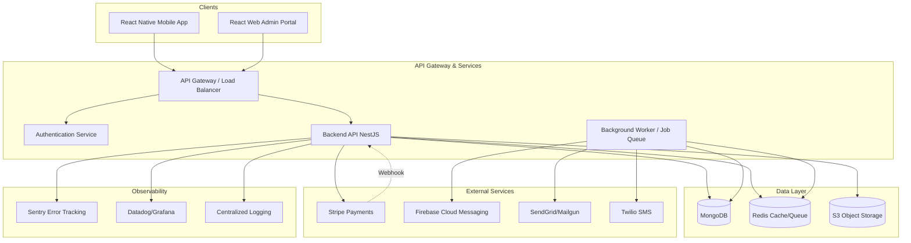

# System Architecture

## High-Level Architecture Diagram

## Component Responsibilities

### Clients
- **Mobile App**: Primary member experience - view workouts, log exercises, track progress
- **Web App**: Admin portal for owners/trainers - manage members, assign workouts, view analytics

### Backend Services
- **API Gateway**: Routes requests, handles rate limiting, SSL termination
- **Authentication Service**: JWT token management, role-based access control
- **Backend API**: Core business logic - memberships, workouts, scheduling
- **Background Worker**: Scheduled tasks - workout assignment, notifications, payment reconciliation

### Data Stores
- **MongoDB**: Core document data (users, gyms, memberships, workouts, logs)
- **Redis**: Session storage, rate limiting, job queue broker
- **S3**: Exercise media (images/videos), receipts, invoices

### Third-Party Integrations
- **Stripe**: Payment processing, subscriptions, webhooks
- **FCM**: Push notifications
- **SendGrid/Mailgun**: Email delivery
- **Twilio**: SMS notifications

## Data Flow Examples

### Member Views Today's Workout
1. Mobile app authenticates → receives JWT
2. App calls `GET /api/workouts/today`
3. API validates JWT, queries MongoDB `assigned_workouts` collection for user
4. API fetches exercise details and media URLs from S3
5. Response cached in Redis (5min TTL)
6. Mobile app renders workout with exercises

### Owner Assigns Workout Template
1. Owner creates/selects template via web app
2. Web app calls `POST /api/workouts/assign`
3. API creates `assigned_workout` documents in MongoDB
4. Background worker job enqueued to generate recurring workouts
5. Worker creates future `assigned_workout` documents per recurrence rules
6. Notification jobs scheduled for workout reminders

### Member Completes Exercise
1. Member marks exercise complete in mobile app
2. App calls `POST /api/workouts/:id/exercises/:exerciseId/complete`
3. API creates `exercise_log` document in MongoDB
4. API updates `assigned_workout` completion status
5. If all exercises complete, trigger completion webhook/notification

### Payment Processing
1. Member initiates payment via Stripe Checkout
2. Stripe redirects to success/cancel URLs
3. Stripe webhook calls `POST /api/webhooks/stripe`
4. API verifies webhook signature
5. API updates `membership` status and creates `payment_record` document in MongoDB
6. Background job sends receipt email

## Security Boundaries

- **Authentication**: All API endpoints require valid JWT token
- **Authorization**: Role-based access (owner/trainer/member) enforced server-side
- **Payment Security**: No card data stored; all payments via Stripe tokens
- **Webhook Security**: All webhooks verified with provider signatures
- **Data Encryption**: TLS in transit, encryption at rest for sensitive data

## Scalability Considerations

- **Stateless API**: Horizontal scaling via load balancer
- **Database**: MongoDB replica sets for high availability and read scaling
- **Caching**: Redis for frequently accessed data (workout templates, user sessions)
- **Queue**: BullMQ with Redis for background job processing
- **CDN**: CloudFront for S3 media assets

## Deployment Architecture

### Development
- Docker Compose: All services locally
- Hot reload for development

### Staging
- Vercel/Netlify: Frontend preview deployments
- Render: Staging backend + DB
- Separate Stripe test account

### Production
- **Frontend**: Vercel/Netlify (CDN + edge functions)
- **API**: AWS ECS Fargate / Render (auto-scaling)
- **Database**: MongoDB Atlas (managed MongoDB with replica sets)
- **Cache/Queue**: AWS ElastiCache / Upstash Redis
- **Storage**: AWS S3 + CloudFront
- **Monitoring**: Sentry + Datadog

